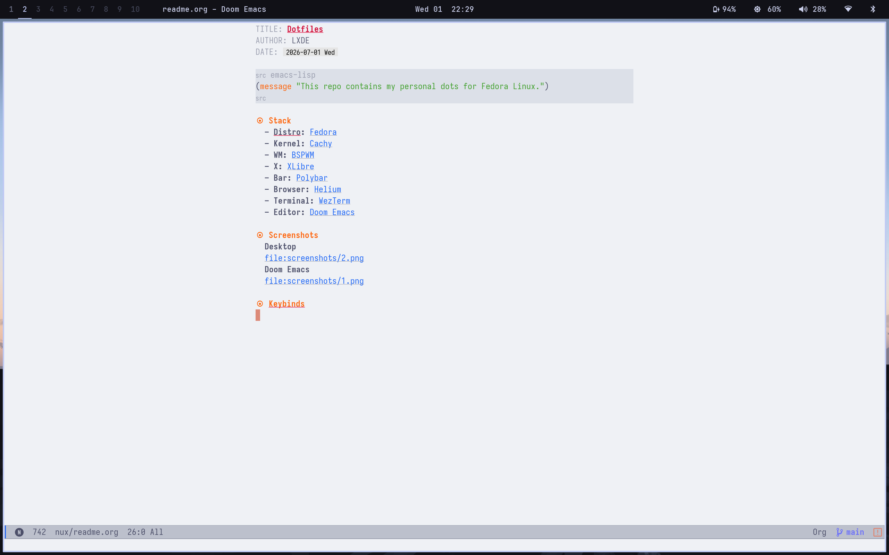
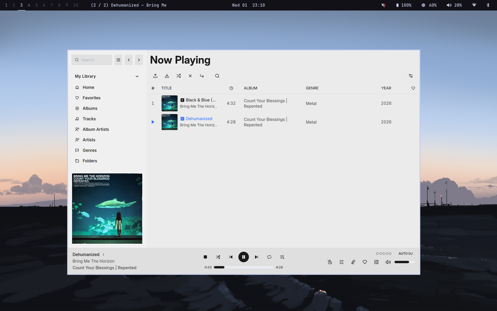

#+TITLE: Dotfiles
#+AUTHOR: lxde
#+DATE: <2026-07-01 Wed>

#+begin_src emacs-lisp
(message "I pretty much spend all my time in emacs!")
#+end_src

* Details
*** System & Core
- *OS:* [[https://fedoraproject.org/][Fedora]]
- *Kernel:* [[https://copr.fedorainfracloud.org/coprs/bieszczaders/kernel-cachyos/][Cachy]]
- *WM:* [[https://github.com/baskerville/bspwm][BSPWM]]
- *X:* [[https://github.com/x11libre/xserver][XLibre]]
- *Bar:* [[https://github.com/polybar/polybar][Polybar]]
- *Shell*: [[https://www.zsh.org/][Zsh]]
*** Applications
- *Browser:* [[https://helium.computer/][Helium]]
- *Terminal:* [[https://wezterm.org/][WezTerm]]
- *Editor:* [[https://github.com/doomemacs/core][Doom Emacs]]
- *Launcher*: [[https://github.com/davatorium/rofi][Rofi]]
- *TUI File Manager*: [[https://github.com/kamiyaa/joshuto][Joshuto]]
- *File Manager*: [[https://docs.xfce.org/xfce/thunar/start][Thunar]]
- *Music Player*: [[https://github.com/jeffvli/feishin][Feishin]]

* Screenshots
#+begin_src emacs-lisp
(message "I have no coherent themes, I've been trying out dark & lightmode together :P")
#+end_src
*Desktop*
[[file:screenshots/2.png]]
*Doom Emacs*
[[file:screenshots/1.png]]
*Org Mode*

*Feishin*

