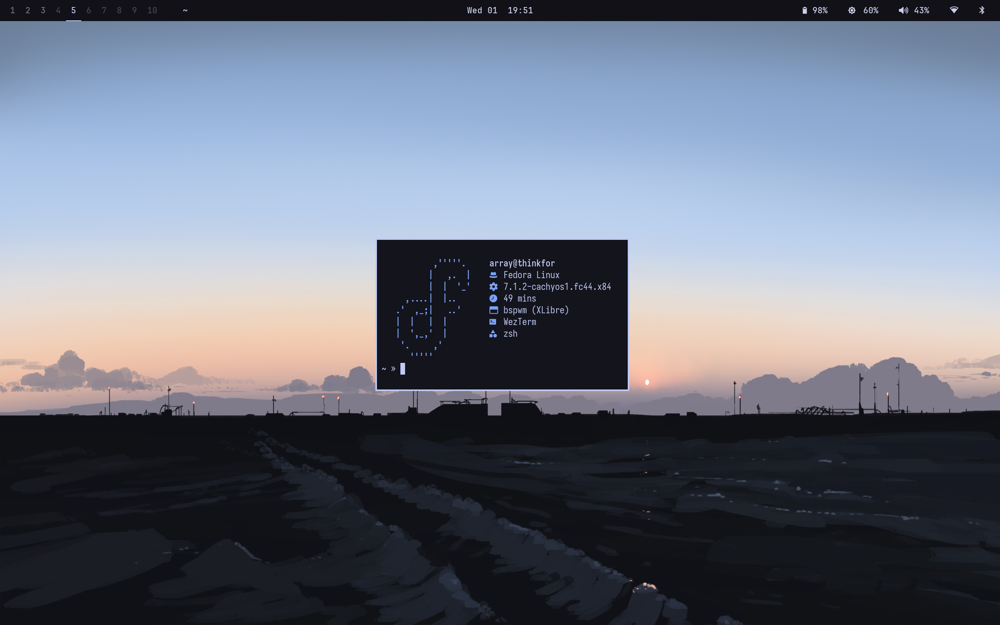
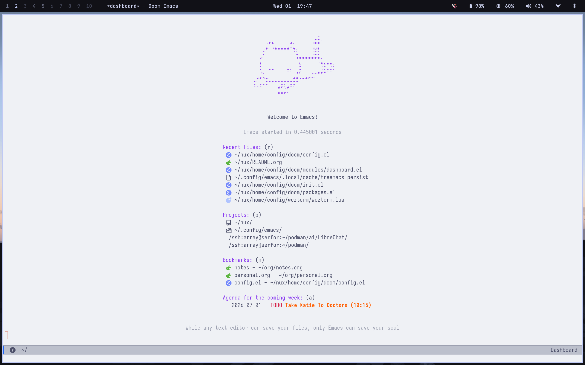

#+TITLE: Dotfiles
#+AUTHOR: LXDE
#+DATE: <2026-07-01 Wed>

#+begin_src emacs-lisp
(message "Welcome to my dotfiles!")
#+end_src
#+begin_src python
print("Here")
#+end_src
* Stack
- *Distro:* [[https://fedoraproject.org/][Fedora]]
- *Kernel:* [[https://copr.fedorainfracloud.org/coprs/bieszczaders/kernel-cachyos/][Cachy]]
- *WM:* [[https://github.com/baskerville/bspwm][BSPWM]]
- *X:* [[https://github.com/x11libre/xserver][XLibre]]
- *Bar:* [[https://github.com/polybar/polybar][Polybar]]
- *Browser:* [[https://helium.computer/][Helium]]
- *Terminal:* [[https://wezterm.org/][WezTerm]]
- *Editor:* [[https://github.com/doomemacs/core][Doom Emacs]]

* Screenshots
*** Desktop

*** Emacs

